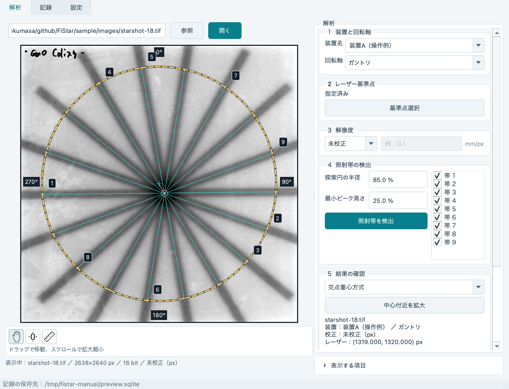
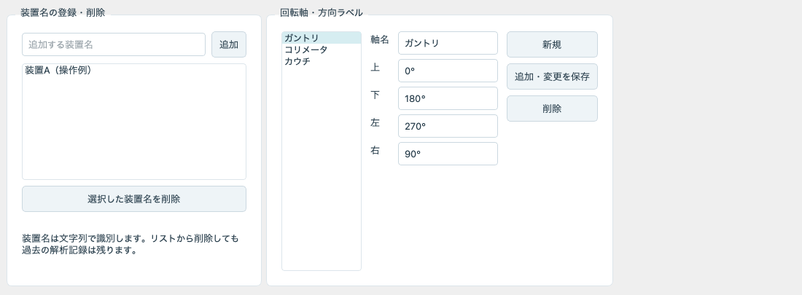
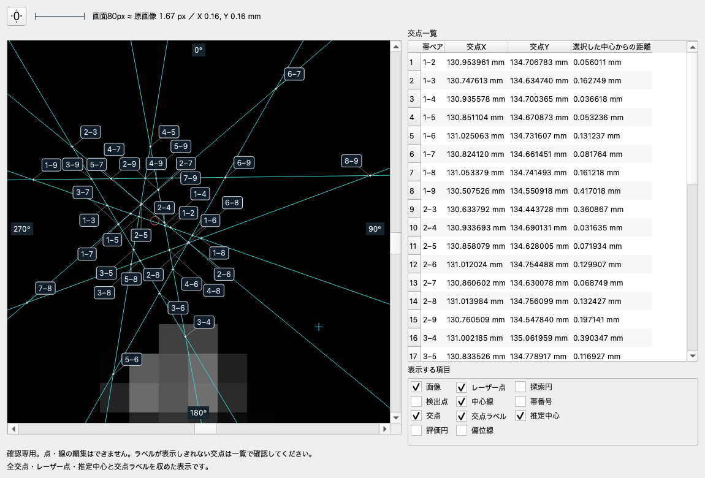
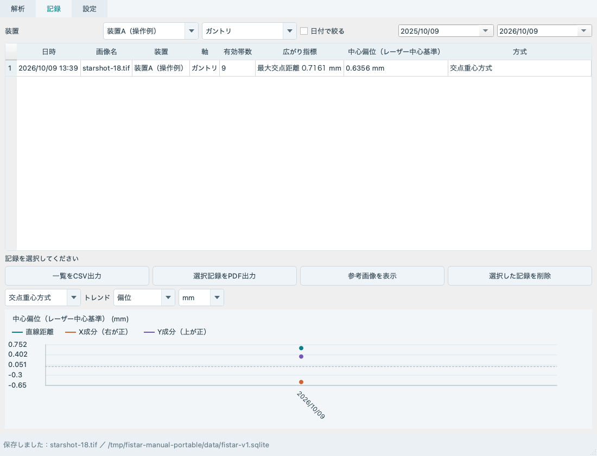

# FiStar 操作マニュアル

フィルムスキャンTIFFを用いた2Dスターショットの解析・記録・レポート出力

## 1. はじめに・基本の流れ

FiStarは、画像から照射帯の中心線を検出し、推定中心とレーザー基準点の位置関係を調べるソフトです。

施設内QAの補助ツールです。実画像の臨床的精度は未検証のため、検出した線・基準点・解像度を確認し、施設の手順に従って判断してください。

### 簡易操作解説

1. 「参照」で解析するTIFF画像を選び、画像を開きます。
2. 「1 装置と回転軸」で装置名と軸を指定します。装置名は空欄でも保存できます。
3. 「2 レーザー基準点」の「基準点選択」を押し、画像上を左クリックします。
4. 「3 解像度」で未校正・TIFFタグ・入力値を選びます。
5. 「4 照射帯の検出」の「照射帯を検出」を押します。
6. 検出線と結果を確認し、「結果を確認して保存」を押します。

画面右側が見切れる場合は、解析欄をスクロールしてください。

<!-- pagebreak -->

## 2. 初期設定

### 設定タブ

画面上部から設定タブを開いて、装置名と回転軸・方向ラベルを任意に設定できます。

### 装置名

装置名を入力して「追加」を押すと、解析タブの候補に登録されます。削除する場合はリストで選び、「選択した装置名を削除」を押します。過去の記録は削除されません。

解析タブでは候補の選択と手入力の両方が使えます。候補を選ぶと入力欄を上書きします。手入力した名前は候補リストへ自動登録されません。装置名は文字列で区別されるため、同じ装置には表記を揃えてください。

### 回転軸・方向ラベル

- 追加：「新規」→軸名と上・下・左・右を入力→「追加・変更を保存」。
- 編集：左のリストで軸を選択→入力欄を書き換え→「追加・変更を保存」。
- 削除：リストで軸を選択→「削除」。少なくとも1軸は残してください。

| 初期の軸名 | 上  | 下   | 左   | 右  |
| ---------- | --- | ---- | ---- | --- |
| ガントリ   | 0°  | 180° | 270° | 90° |
| コリメータ | G   | T    | 270° | 90° |
| カウチ     | H   | F    | L    | R   |

方向ラベルは画像の四辺に表示します。画像を回転させたり、偏位のX/Y成分を方向名へ変換したりする設定ではありません。

<!-- pagebreak -->

## 3. 画像を開く・基準点を指定する

### 画像ファイル

「参照」でファイルを選ぶと、そのまま読み込みます。パス欄へ直接入力し、「開く」またはEnterでも読み込めます。前回正常に開いた画像パスを次回起動時に復元します。

解析対象はTIFF画像です。

### 画像の操作

| 操作                                 | 動作                             |
| ------------------------------------ | -------------------------------- |
| 手のアイコン・通常の左ドラッグ       | 画像を移動                       |
| 上スクロール／下スクロール           | 拡大／縮小。現在の表示中心が基準 |
| リセットアイコン／ダブルクリック     | 画像全体を表示                   |
| 定規アイコン→画像内の2点を左クリック | 2点間の長さを測定                |

### レーザー基準点

1. 必要に応じて画像を拡大し、基準にする穴・印の位置を確認します。
2. 解析欄の「基準点選択」を押します。
3. 画像上の位置を左クリックします。指定後は自動で画像移動モードへ戻ります。

修正するときは、再度「基準点選択」を押して左クリックします。選択ボタンを再度押すか、手のアイコンを押すと選択状態を解除できます。

### 表示する項目

解析欄の下にある「表示する項目」を開くと、レーザー点、探索円、検出点、中心線、帯番号、交点、交点ラベル、推定中心、評価円、偏位線を切り替えられます。交点ラベルは初期OFFです。

表示設定は起動中だけ保持します。見づらいときは不要な表示を一時的にOFFにしてください。中心線の手動追加・移動・回転はできません。

<!-- pagebreak -->

## 4. 解像度の設定・定規による校正

解像度設定は解析フレーム内の「3 解像度」にあります。初期値は「未校正」です。

| 方法     | 操作と結果                                                                          |
| -------- | ----------------------------------------------------------------------------------- |
| 未校正   | px単位で解析・保存します。mmとしては扱いません。                                    |
| TIFFタグ | TIFFに記録されたX/Y解像度を使います。利用可能なタグがない場合は別の方法を選びます。 |
| 入力値   | 1pxあたりの長さをmm/pxで入力します。X/Y共通の値です。                               |

例：1pxが0.1mmなら「0.1」と入力します。0、負の数、未入力など無効な値では検出・保存ができません。設定後の解像度は画像下の画像情報欄で確認できます。

### 定規で長さを測る

1. 画像下の定規アイコンを押します。
2. 測りたい2点を画像内で左クリックします。
3. 画像下に長さが表示されます。未校正ならpx、校正済みならpxとmmです。

### 既知の長さから校正する

1. 定規アイコンを押し、その右の「校正」を押します。
2. 入力欄に既知の長さをmmで入力します。
3. その長さに対応する両端を画像内で左クリックします。
4. 計算されたmm/pxと測定値を確認します。

**mm/px＝既知の長さ［mm］÷2点間の画素距離［px］**です。たとえば10mmが100pxなら0.1mm/pxとなります。この方法で設定する解像度はX/Y共通です。

同一点の指定や0以下の長さは使えません。校正待ちの間は検出・保存が止まります。取り消す場合は「中止」または手のアイコンで元の解像度へ戻してください。

TIFFタグに値があっても、その値が今回の画像の縮尺として適切か確認してください。未校正の記録とmm校正済みの記録は、同じ単位のトレンドとして混在させません。

<!-- pagebreak -->

## 5. 照射帯の検出と調整

「照射帯を検出」を押すと、レーザー基準点を中心とした円周上で暗い帯を検出します。初期値は探索円の半径85%、最小ピーク高さ25%です。円周の反対側にある腕同士を結び、1本の中心線にします。

### 探索円の半径

基準点から最も近い画像端までの距離を100%とする割合です。その距離が100pxなら、85%で半径85pxになります。値を変えると探索円の表示が更新されます。

円が各照射帯を横切る位置になるよう調整します。帯が重なりすぎる中央付近や、帯が途切れる位置を避けられているか、画像を見ながら確認してください。

### 最小ピーク高さ

円周上の濃淡を一周読み取り、暗い照射帯を山（ピーク）として扱います。円周データの最低値を0にし、最も高い山を100%としたときの、採用候補の下限です。

25%なら、最高の山の高さが100のとき、高さ30の山は候補、高さ20の山は対象外です。ピーク間の間隔など、ほかの検出条件も適用されます。

| 変更       | 起こりやすいこと                                             |
| ---------- | ------------------------------------------------------------ |
| 値を下げる | 薄い帯を拾いやすくなる一方、ノイズも拾いやすくなる           |
| 値を上げる | 小さなノイズを除きやすくなる一方、薄い帯を見落とすことがある |

この割合は照射線量の割合ではありません。また、検出した帯の中心を求める「半値幅の50%」とは別の設定です。

### 検出後の確認

- 中心線が各照射帯に沿っているか、帯番号と一覧の本数を確認します。
- 不要な帯は一覧のチェックを外して除外します。再びチェックすると有効に戻ります。
- 検出が足りない・余分な帯がある場合は条件を調整し、再検出します。線を手動で追加・移動・回転する機能はありません。

レーザー基準点、探索円の半径、最小ピーク高さを変更した後は、必ず再検出してください。自動で条件を再探索する処理はありません。

<!-- pagebreak -->

## 6. 結果の読み方と保存

### 中心推定方式

| 方式                   | 推定中心                                             | 広がりの値                                   |
| ---------------------- | ---------------------------------------------------- | -------------------------------------------- |
| 交点重心方式（初期値） | 有効な中心線の全ペアの交点を等しい重みで平均した位置 | 最大距離：推定中心から最も遠い交点までの距離 |
| 最小円方式             | 各中心線への垂直距離の最大値を最小にする位置         | 最大半径：その中心から中心線への最大垂直距離 |

方式を切り替えても照射帯の再検出は行いません。同じ有効中心線を使って表示する結果を切り替えます。どちらも3方向以上の有効な中心線が必要です。

### 中心偏位（レーザー中心基準）

レーザー点を起点に、推定中心がどちらへどれだけ離れているかを示します。

| 表示値    | 意味                                       |
| --------- | ------------------------------------------ |
| 直線距離  | レーザー点と推定中心の距離。負にはならない |
| Xが正／負 | 推定中心がレーザー点より右／左             |
| Yが正／負 | 推定中心がレーザー点より上／下             |

例：X＝+0.3mm、Y＝−0.4mmは、推定中心がレーザー点より右へ0.3mm、下へ0.4mmで、直線距離は0.5mmです。

**位置を表す座標と、偏位の成分はYの向きが異なります。** 中心・交点の画像座標は右・下方向に増加します。偏位は右・上が正です。方向ラベルを変更しても、この符号は変わりません。

### 交点重心方式での注意

同じ場所に重なる交点もペアごとに数えます。平行・同一直線のペアは交点を定義できず、平均から除外します。ほぼ平行な線の遠方交点や画像外の交点は自動除外されません。1度未満の線間角度には警告が出るため、一覧で確認してください。

### 保存

画像、基準点、解像度、検出した帯、選択方式の結果を確認し、「結果を確認して保存」を押します。記録タブに追加されます。装置名は空欄でも保存できます。

保存できないときは解析欄の案内を確認してください。校正未完了、再検出が必要な状態、有効な線の不足、選択方式が計算不能な状態では保存できません。保存時に参考用JPEGも作成します。JPEGは閲覧用で、再解析には使用しません。

<!-- pagebreak -->

## 7. 中心付近の拡大で確認する

「5 結果の確認」の「中心付近を拡大」を押すと、確認専用の別ウィンドウを開きます。メイン画像の表示位置・倍率は変わりません。

左に拡大画像、右に交点一覧と表示項目があります。画像の倍率は、レーザー点・選択方式の推定中心・全交点とラベルが収まるよう自動設定されます。

- 水色はレーザー点、赤は交点重心、紫は最小円中心、白は交点です。
- 「1–2」などのラベルは、交差する帯番号のペアです。同じ位置の交点はラベルをまとめます。
- 左ドラッグで移動、スクロールで拡大縮小できます。リセットまたはダブルクリックで全点を収めます。
- 右側の一覧には交点X/Yと選択した中心からの距離を表示します。画像外の交点も一覧に残ります。
- 表示チェックはメインと独立しています。点や線の編集はできません。

遠方の交点があると全体を収めるため倍率が低くなります。確認したい部分へ手動で拡大し、全体の確認時はリセットしてください。スケールは元画像px数、校正済みの場合はX/Yのmm値も表示します。

別画像へ切り替えた場合や選択方式が計算不能になった場合は、拡大ウィンドウを閉じます。過去記録は保存済みの情報を表示します。交点情報が保存されていない記録では、交点の追加計算は行いません。

<!-- pagebreak -->

## 8. 記録・トレンド・CSV

### 記録の検索と参考画像

「記録」タブの装置・軸で絞り込みます。期間を指定する場合は「日付で絞る」をONにし、開始日と終了日を指定します。

記録を1件選び「参考画像を表示」を押すと、保存済みJPEGと中心線・交点を閲覧できます。過去記録を解析画面へ再開する機能はありません。元TIFFを移動・削除しても、保存した参考JPEGは閲覧とPDF出力に使えます。

Ctrlキー（macOSはCommandキー）を押しながらクリックすると複数の記録を選べます。Shiftキーでは連続した範囲を選べます。「選択した記録を削除」を押し、確認画面で承認すると、選択した記録と対応するJPEGを削除します。元TIFFは削除しません。参考画像表示とPDF出力は1件を選んで操作してください。

### トレンド

装置と軸を個別に選択すると表示します。初期方式は交点重心方式、初期指標は偏位です。単位はmm／pxから対象の記録に合わせて選んでください。

- 偏位：直線距離・X成分・Y成分を同じグラフで色分け表示します。
- 最大距離：交点重心から最も遠い交点までの距離です。
- 最大半径：最小円方式の半径です。方式に応じて名称が変わります。

横軸は測定日時順の等間隔です。斜めの日付ラベルを表示し、期間の空白で点の間隔は広がりません。画面に多数の記録を表示する場合は、ラベルを間引くことがあります。方式・単位の異なる値を同一系列へ混在させません。

### CSV出力

「一覧をCSV出力」で、現在の絞り込みに該当する一覧をUTF-8のCSVへ出力します。方式、中心、偏位X/Y、広がり、交点数などを含みます。PDFの「最大15件」はトレンドの制限であり、CSV一覧の件数制限ではありません。

<!-- pagebreak -->

## 9. PDFレポートを出力する

1. 記録タブで出力したい記録を選びます。
2. トレンドに使う期間があれば「日付で絞る」で指定します。
3. 「選択記録をPDF出力」を押します。
4. 任意のコメントを入力します（500文字まで・空欄可）。
5. 保存先を指定します。コメントはPDFだけに使用し、記録には保存しません。

### 掲載内容

| ページ       | 内容                                                                       |
| ------------ | -------------------------------------------------------------------------- |
| 1ページ目    | 基本情報・結果の表、全体画像、偏位と最大距離／最大半径のトレンド、コメント |
| 2ページ目    | 中心付近の拡大画像、帯ペアと推定中心からの距離の一覧                       |
| 続きのページ | 交点が多い場合の一覧の続き                                                 |

交点一覧は3列で、各列を上から下へ読み、次の列へ続きます。交点X/YはPDFに載せません。必要な場合はアプリの拡大ウィンドウで確認してください。

### PDFのトレンド条件

選択記録と同じ装置名・軸・方式・結果の単位を対象に、指定期間内の最新15件を掲載します。期間指定がなければ全期間です。装置名の空欄も同一の名前として扱います。

日付は45度で表示し、15件すべてを等間隔に並べます。選択した記録は輪郭マーカーで強調します。最新15件に含まれない場合などは対象外の注記が出ます。選択記録より後の測定も、期間内なら対象に含みます。

### 画像と旧記録

PDFは保存済みの結果から作成します。現在の画面のパン・倍率・表示チェックには依存せず、再検出や中心の再推定は行いません。

参考JPEGが見つからない、読めない場合は、画像欄に理由を記載し、数値・一覧・トレンドを出力します。旧記録に方向ラベルや交点情報がなければ、その旨を記載します。

PDFはA4縦で、通常は2ページです。多数の交点、長い名称・コメントについては出力結果を確認してください。名称が長すぎて収まらない場合は、短い名称で記録を保存し直してください。

<!-- pagebreak -->

## 10. 保存先・バックアップ・困ったとき

### 保存先とバックアップ

解析記録は、WindowsではFiStar.exeの隣、macOSではFiStar.appの隣にある「data」フォルダへ保存します。DBは「fistar-v1.sqlite」、前回の画像パス・軸は「fistar-preferences.ini」、参考JPEGは「images」フォルダです。初回起動時に作成します。

移植・バックアップはアプリを終了して「data」フォルダ全体をコピーしてください。元TIFFは移植に不要です。アプリ更新時はdataを保持し、アプリとライブラリだけ差し替えます。配布するdataは空にしてください。

書込み可能なフォルダにアプリ一式を置いてください。フォントキャッシュはユーザー別の保存先に保管し、dataの移植対象には含めません。

旧保存先の記録を使いたい場合は、設定タブの「旧記録を取り込む」で旧DBを指定します。元DBは変更せず、読める元TIFFからJPEGを作成します。元画像がない記録も数値は取り込みます。以前のmacOS保存先は「~/Library/Application Support/FiStar/FiStar」、Windowsは「%APPDATA%\FiStar\FiStar」です。

### 実行ファイル版の起動

Windows版は配布されたZIP全体を展開し、フォルダ内の「FiStar.exe」を起動します。exeと同梱ファイルは一緒に保管してください。macOS版は「FiStar.app」を起動します。

画面表示後、解析機能をバックグラウンドで準備します。準備中も画像選択などの操作は可能です。「照射帯を検出」を押すと準備完了後に実行します。初回の準備情報はキャッシュに保存し、次回以降に再利用します。準備中に画像・基準点・検出条件を変えた場合は、案内に従い再度検出してください。準備に失敗した場合は「解析準備を再試行」を押します。

### 主な症状と対処

| 症状                              | 確認すること                                                                                       |
| --------------------------------- | -------------------------------------------------------------------------------------------------- |
| 検出ボタンを押せない              | 画像、レーザー基準点、解像度設定が完了しているか確認。校正中なら完了または中止する。               |
| TIFFタグを使用できない            | 未校正で進めるか、入力値・定規校正を使う。                                                         |
| 検出点が奇数／6点未満             | 基準点と探索円を確認し、半径・最小ピーク高さを調整して再検出する。                                 |
| 薄い帯を拾えない                  | 最小ピーク高さを少し下げる。探索円が帯を横切っているかも確認する。                                 |
| 余分な帯を拾う                    | 最小ピーク高さを少し上げるか、不要な帯を一覧で除外する。                                           |
| 「再検出が必要」と表示            | 基準点・半径・ピーク高さを変更した後に「照射帯を検出」を押す。                                     |
| 中心が遠い／最大距離が大きい      | ほぼ平行な線、遠方の交点、除外漏れを拡大画像と一覧で確認する。                                     |
| トレンドが出ない                  | 装置と軸を個別に選び、期間・方式・mm／pxが対象の記録と合うか確認する。                             |
| 保存ボタンを押せない              | 未完了の校正、再検出の案内、有効な線の不足、計算不能を確認。保存済みで変更がない場合も無効になる。 |
| 参考画像が表示できない | data/imagesのJPEGを確認。画像がなくても数値は閲覧・出力できる。 |
| PDFで日本語が出ない／出力できない | 日本語フォントの利用可否、保存先への書込み権限、表示されたエラーを確認する。                       |

検出にはPylinac 3.48.0を使用します。ライセンスはプロジェクトの「THIRD_PARTY_NOTICES.md」、検証範囲は「docs/validation-v1.md」を参照してください。
